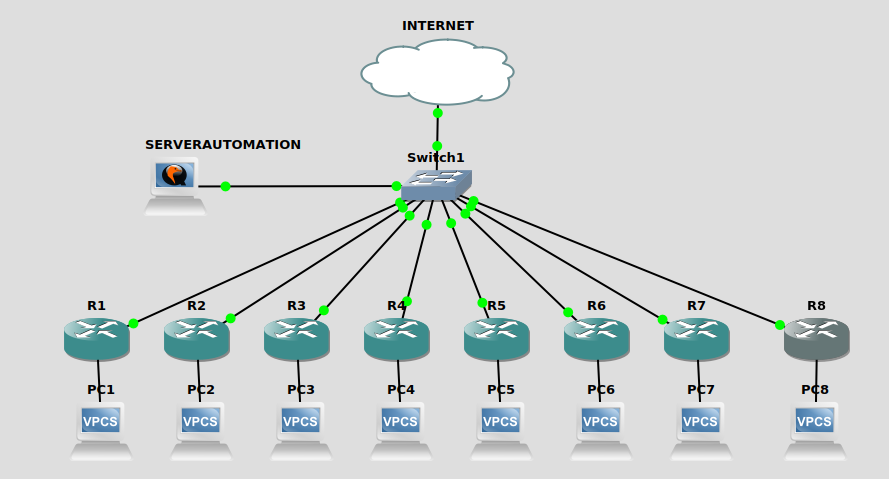

# automation-basic-3
network automation with paramiko and iteration using 8 device Mikrotik

<h3>Topology</h3>
This repository is tested using this Topology

<h3>Requirement</h3>
To run this repository, you need some python library installed on your computer.
<ul>
    <li>Python 3.6.5</li>
    <li>paramiko</li>
</ul>    
<h3>Setup</h3>
<ol>
    <li>Clone this repository</li>
        <ul>
            <li>git clone https://github.com/verysetiawan/automation-basic-3.git</li>
            <li>cd automation-basic-3</li>
        </ul>
    <li>Install requirement library</li>
        <ul>
            <li>virtualenv -p python3 auto3env</li>
            <li>source auto3env/bin/activate</li>
            <li>pip install -r requirement</li>
        </ul>
     <li>Editing script auto3.py</li>
        <ul>
            <li>open script python auto3.py with text editor</li>
            <li>change the ip address with yours</li>
       </ul>
    <li>Run the python script</li>
        <ul>
            <li>python3 auto3.py</li>
        </ul>
